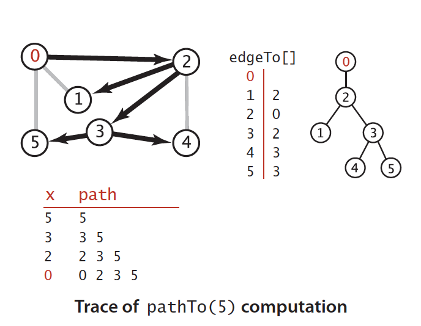
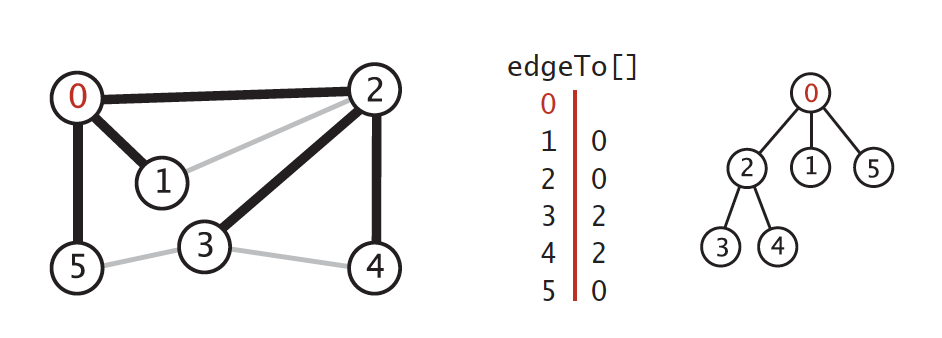
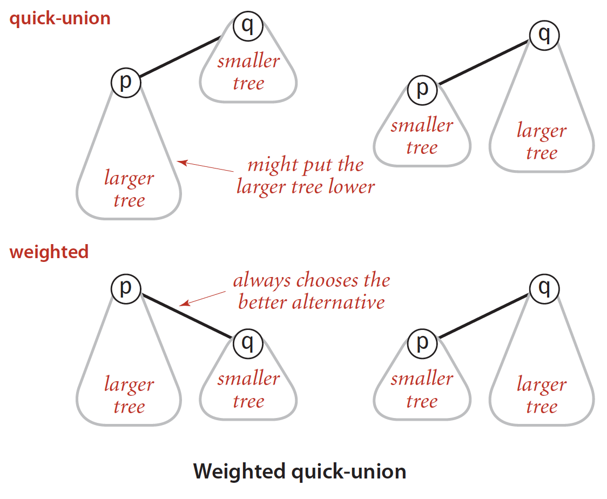
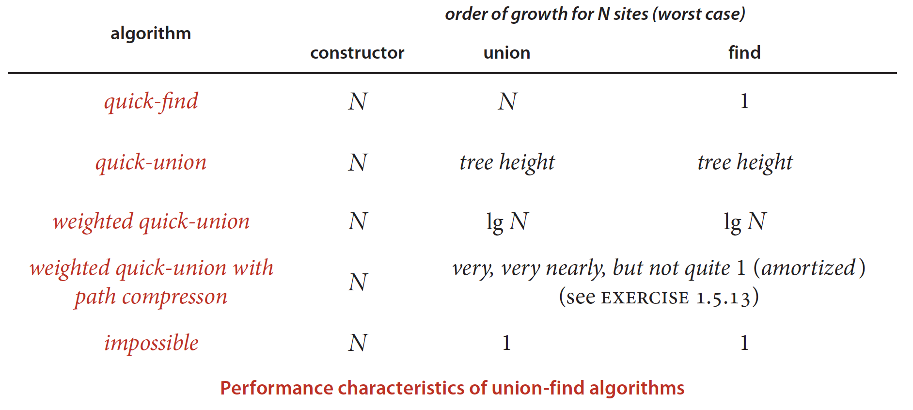
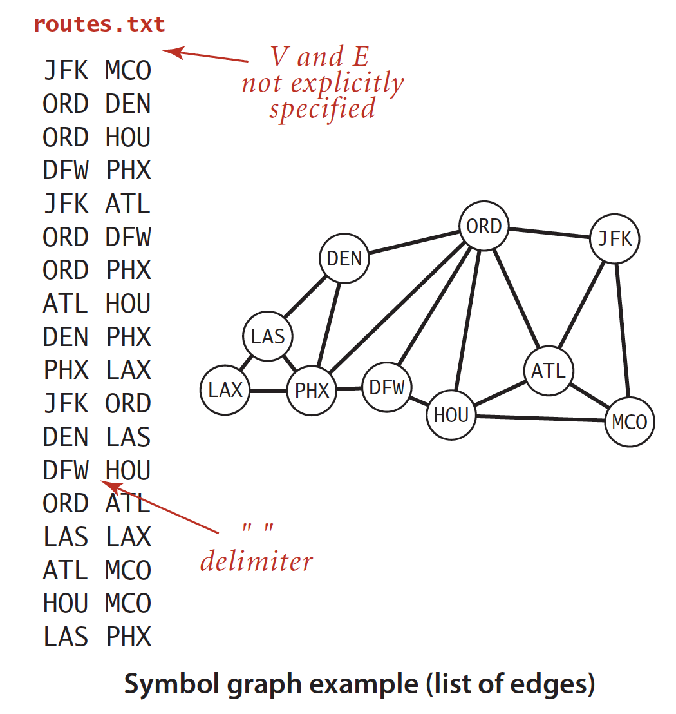
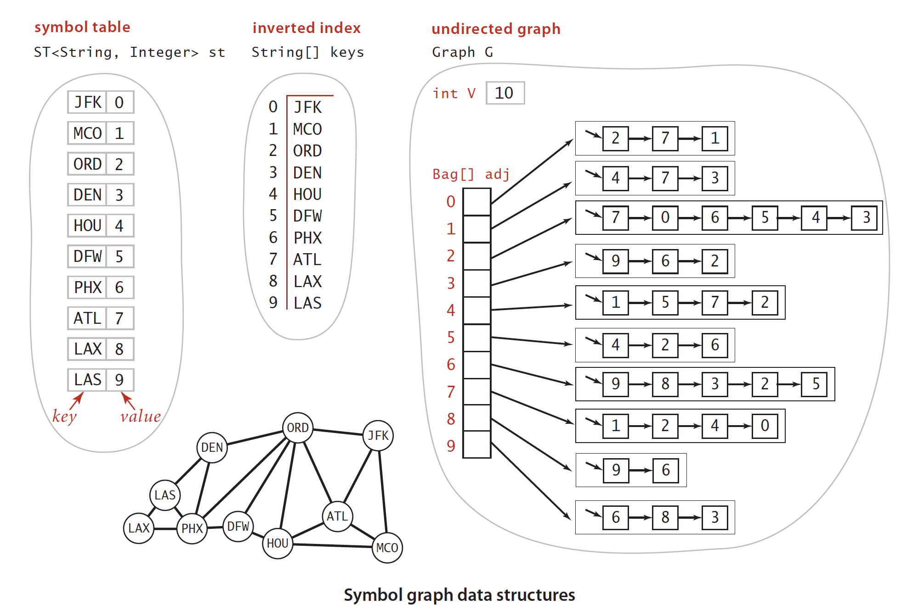

#无向图

# 一. 无向图相关的常见术语

（1）当两个顶点通过一条边相邻时，我们称这两个==顶点是相邻的==。


（2）某个==顶点的度数==即为依附于它的边的总数。


（3）==子图==：由一幅图的所有边的一个子集(以及所依附的所有顶点的子集)组成的图。


（4）==路径==：由边顺序连接的一系列顶点。


（5）==简单路径==：一条没有重复顶点的路径。


（6）==环==：至少含有一条边，且起点和终点相同的路径。


（7）==简单环==：出了起点和终点外，没有重复顶点和边的环。


（8）==路径或则环的长度==：是其所包含的边的数量。


（9）==连通图==：从任意一个顶点都存在一条路径到达另外一个任意顶点就称这个图是连通图。


（10）==极大连通图==：一个非连通的图由若干连通的部分组成，它们都是极大连通子图。


（11）==无环图==：一张不包含环的图。


（12）==树==：是一张无环连通图。


（13）==图的密度==：已经连接的顶点对 占 所有可能被连接的顶点对的比例。


（14）==稀疏图==：被连接的顶点对很少。


（15）==稠密图==：很少的顶点对没有边连接。


（16）无向图G的极大连通子图称为G的==**连通分量**( Connected Component)==。任何连通图的连通分量只有一个，即是其自身，非连通的无向图有多个连通分量。


# 二. 无向图的数据类型

要学习图相关的算法，首先我们得定义图的数据结构，以及一份基本的操作的API.

- API 

```java
public Graph(int V) 

public Graph(In in)

public int V()

public int E()
   
public void addEdge(int v, int w)

public Iterable<Integer> adj(int v)
```

## 1. 图的表示方法：数据结构

定义一个图有V个节点，E条边。我们希望有一个数据结构能够完整表示图这种逻辑结构而且满足以下要求：

- 必须为应用中可能碰到的各种图足够节省空间，因为当节点是百万级别时候，必须要节省空间。

- Graph的基本API实现必须要快，因为它们是实现各种算法的基础。

  ​

### （1）邻接矩阵：

用一个V*V的布尔矩阵表示，当顶点v和w相连接的时候，则v行w列的数据时true,否则为false。这种表达方法相当占用内存，有百万节点的图是很常见的，V^2个布尔值占用内存是不能够接受的。


### （2）邻接表数组

使用一个以顶点为索引的List列表数组，其中每个元素都是和该顶点相邻的顶点列表。 该方法能满足上面我们说的两点要求。本文后面我们都会使用这种方式。


###（3）边的数组

我们可以使用一个Edge类表示边，里面有两个整数表示两边的节点。这种方法很简单，但是实现Graph的基本API，比如adj()需要遍历所有的边，很繁琐。也不适合


## 2. 邻接表的数据结构


```java
/**
 * 图的基本API以及物理存储：邻接表实现
 *
 * @author 惜暮
 * @email chris.lyt@cainiao.com
 * @date 2017/11/29
 */
public class Graph {
    /** 图的顶点数目 */
    private final int V;
    /** 图的边的数目 */
    private int E;
    /** 图的邻接表表示形式， Bag是对链表的一个封装 */
    private Bag<Integer>[] adj;

    /**
     * 创建有V各节点，0条边的无向图
     * 
     * @param V 图中的节点数
     */
    public Graph(int V) {
        this.V = V;
        this.E = 0;
        /* 创建邻接表 */
        adj = (Bag<Integer>[])new Bag[V];
        for (int i=0; i<V; i++){
            adj[i] = new Bag<>();
        }
    }

    /**
     * 读取文件里面的数据构造一个图
     *
     * @param in 图的数据源
     */
    public Graph(In in){
        this(in.readInt());//第一行是节点数
        int E = in.readInt();//第二行是边的数量
        for(int i=0; i<E; i++){
            int v = in.readInt();
            int w = in.readInt();
            addEdge(v, w);// 连接一条边
        }
    }
	
    public int V(){
        return this.V;
    }

    public int E(){
        return this.E;
    }

    /**
     * 在节点v 和 节点w之间建立一条边
     *
     * @param v 节点v
     * @param w 节点w
     */
    public void addEdge(int v, int w){
        adj[v].add(w);
        adj[w].add(v);
        E++;
    }

    /**
     * 返回和节点v相邻的所有节点
     *
     * @param v 节点v
     * @return 与节点v相邻的节点的List
     */
    public Iterable<Integer> adj(int v){
        return adj[v];
    }
}
```


## 3. 图的处理算法的设计模式

我们设计图的算法时候，首要目标就是将具体算法的实现和图的表示隔离开，因此，对于不同的图的算法，会穿件一个独立的类。


除了前面的基本图的结构，我们新增关于search的API

```java
public interface Search{
  	Search(Graph G, int s);//找到和起点S连通的所有顶点
    boolean marked(int v);// v和s是连通的吗
  	int count();//与s连通的所有顶点数
}
```


# 三. 深度优先搜索(DFS)

代码见源码文件工程-javamaven

```java
package com.example.algorithm4.graphs;

/**
 * <p>DFS 深度优先遍历</p>
 * <p>此算法有个缺点：对于有E条边的图，算法需要需要遍历2E次边。也就是每条边被访问两次，比如：
 * 对于v-w的边，第一次访问时，v已被标记，w被标记已访问，当从w-v时，也要访问一次，只不过会判断v已经被
 * 访问过了，所以return.
 *
 * @author 惜暮
 * @email chris.lyt@cainiao.com
 * @date 2017/11/30
 */
public class DepthFirstSearch {
    /**
     * 节点是否被访问过，比如从v-w 这个，如果w已经被访问过了，那么marked[w]就是true
     */
    private boolean[] marked;
    /**
     * 访问的节点数
     */
    private int count;

    /**
     * DFS的构造器
     *
     * @param graph 进行深度优先遍历的图
     * @param s 深度优先遍历的起始节点
     */
    public DepthFirstSearch(Graph graph, int s) {
        this.marked = new boolean[graph.V()];
        dfs(graph, s);
    }

    /**
     * 从图的节点 v 开始进行DFS
     *
     * @param graph 图
     * @param v 开始DFS的起点
     */
    private void dfs(Graph graph, int v){
        marked[v] = true;
        count++;
        for (int w : graph.adj(v)){
            //遍历节点V的所有未访问过的相邻节点
            if(!marked[w]){
                dfs(graph, w);
            }
        }
    }

    /**
     * 判断节点w是否已经被标记
     *
     * @param w 图的节点
     * @return 节点w已经被标记，返回true，否则返回false。
     */
    public boolean marked(int w){
        return marked[w];
    }

    /**
     * 返回总的路径长度
     * @return
     */
    public int count(){
        return count;
    }
}
```


其实很多实际问题都是基于DFS解决的，比如：

- 给定一幅图，判断两个顶点是否是连通的；
- 或则判断一幅图中有多少个连通子图。

这类问题其实也就是路径检测，检测图中是否存在一条从节点A到节点B的路径。这种应用特别多，比如对于社交网络里面的好友关注关系，判断两个人是否是好友，直接通过图的DFS算法进行路径检测就可以得出。


从上面的分析和实现我们可以得出DFS两条结论：

| DFS结论序号 |                  结论                  |
| :-----: | :----------------------------------: |
|   （1）   | 深度优先搜索标记与起点连通的所有顶点所需要的时间和顶点的度数之和成正比。 |
|   （2）   | 深度优先搜索得到从给定起点到任意标记顶点的路径所需时间与路径长度成正比  |


# 四. 寻找路径

单点路径问题在图的算法领域十分常见，我们可以给出如下API设计：

|       Public interface Paths        |                      |
| :---------------------------------: | :------------------: |
|     Paths(Graph graph, int s);      |   在图G中找出所有起点为s的路径    |
|      boolean hasPathTo(int v);      |   是否存在从节点s到节点v的路径    |
| ` Iterable<Integer> pathTo(int v);` | 求s到v的路径，如果不存在就返回null |

构造函数的接受两个参数，第一个参数表示一个无向图，第二个参数表示图的起点。调用  pathTo()函数可以计算从起点s 到任意节点的路径。

比如：对于一个图，其起点是s，求起点s到任意节点v的路径：

下面给出一个实例：求从节点0到节点5的路径，右边是轨迹图。




算法实现如下：

```java
package com.example.algorithm4.graphs;

import java.util.Stack;

/**
 * <p>使用深度优先搜索查找图中的路径</p>
 *
 * @author 惜暮
 * @email chris.lyt@cainiao.com
 * @date 2017/12/1
 */
public class DepthFirstPaths {

    private boolean[] marked;//标记这个顶点调用过DFS嘛？
    private int[] edgeTo;//从起点到一个顶点的已知路劲上的最后一个顶点
    private final int s;//起点

    public DepthFirstPaths(Graph graph, int s) {
        this.marked = new boolean[graph.V()];
        this.edgeTo = new int[graph.V()];
        this.s = s;
        dfs(graph, s);
    }

    /**
     * 图graph 从顶点 V 开始进行DFS
     * @param graph 图
     * @param v 起始顶点
     */
    private void dfs(Graph graph, int v){
        marked[v] = true;
        for(int w : graph.adj(v)){
            if( !marked[w] ){
                edgeTo[w] = v;
                dfs(graph, w);
            }
        }
    }

    public boolean hasPathTo(int v){
        return marked[v];
    }

    public Iterable<Integer> pathTo(int v){
        if( !hasPathTo(v) ){
            return null;
        }
        Stack<Integer> path = new Stack<>();
        for(int x=v; x!=s; x=edgeTo[x]){
            path.push(x);
        }
        path.push(s);
        return path;
    }
}
```


解释：从给定图的起点s开始，找出所有与他连通的顶点的路劲。其中edgeTo数组保存的是一颗用父链接表示的以s为根且含有所有与s连通的顶点的树。


# 五. 广度优先搜索(BFS)

深度优先搜索得到的路径不仅取决于图的结构，还取决于图的表示形式和递归调用的性质。但是我们对图的算法的研究有时候还会对以下问题感兴趣：

> 对于一个给定的图和起点s ，是否存在一条路径从起点s 到顶点v，如果存在，==找出最短路径==。


对于==图的最短路径问题最好的解决方法一般都是图的广度优先搜索(BFS)==。 对于深度优先搜索算法来说，完全不适合解这个问题，DFS遍历图的顺序和最短路径没有任何的关系，相比之下，BFS完全是为了解决这类问题出现的。


**BFS算法的实现：**

BFS使用一个队列来保存所有已经被标记过但其邻接表还未被检查过的点，先将起点加入队列，然后重复执行下面的步骤直到队列为空：

1）取队列中的下一个顶点v并标记它；

2）将与v相邻的所有未被标记过得顶点入队列。


很明显，上面的bfs()算法不是递归的，不像递归中隐式的使用了一个栈，而是显示的使用了一个队列。和DFS一样，其结果也是使用一个toEdge[]数组来保存结果，也是一颗用父链接表示的根节点为s的树，表示s到每个与s连通的顶点的最短路径。


以下图所示的图为例来说明广度优先搜索来遍历图时的过程，下图展示了原始的图G ,以及起始顶点0和最后顶点0的连通图的每个顶点和初始顶点s的最短路径。




首先节点0被加入队列，然后开始下面的循环过程：

1）从队列中删除节点0，并将其相邻的顶点2、1、5分别加入队列之中。标记它们并将它们在toEdge[]数组中的值设置为0；

2）从队列中删除顶点2并检查它相邻的顶点0、1、3、4，发现0和1已经被标记了，不作处理。但是3、4还没被标记，于是加入队列，标记这两个节点并将它们在toEdge[]中的值设置为2。

3）从队列中删除节点1，并检查该节点的邻接节点0、2，发现它们都已经被标记了。

4）从队列中删除节点5，并检查该节点的邻接节点0、3，发现它们都已经被标记了。

5）从队列中删除节点3，并检查该节点的邻接节点2、4、5，发现它们都已经被标记了。

6）从队列中删除节点4，并检查该节点的邻接节点2、3，发现它们都已经被标记了。


具体每一步的流程图如下：


**算法实现如下：**

```Java
package com.example.algorithm4.graphs;

import java.util.LinkedList;
import java.util.Queue;
import java.util.Stack;

/**
 * 使用广度优先搜索查找图中的路径
 *
 * @author 惜暮
 * @email chris.lyt@cainiao.com
 * @date 2017/12/3
 */
public class BreadthFirstPaths {

    private boolean[]  marked; // 到达该顶点的最短路径是否已经算出
    private int[]      edgeTo; // 到达该顶点的已知路径上的最后一个顶点。
    private final int  s;      //起点

    /**
     * 构造器
     *
     * @param graph 一个用存储好了的无向图
     * @param s 起点
     */
    public BreadthFirstPaths(Graph graph, int s) {
        this.marked = new boolean[graph.V()];
        this.edgeTo = new int[graph.V()];
        this.s = s;
        bfs(graph, s);
    }

    /**
     * BFS
     *
     * @param graph 无向图
     * @param s 图的起点
     */
    private void bfs(Graph graph, int s){
        Queue<Integer> queue = new LinkedList<>();
        marked[s] = true;
        queue.add(s);//起点入队列
        while (!queue.isEmpty()){
            int v = queue.remove();//从队列中删除一个节点
            for(int w : graph.adj(v)){
                //遍历节点v的所有邻接点
                if(!marked[w]){
                    edgeTo[w] = v;//设置节点w的父节点是v
                    marked[w] = true;//标记节点w已经访问
                    queue.add(w);//将节点w入队
                }
            }
        }
    }

    /**
     * 是否有从起点s到节点v的路径
     *
     * @param v 目标节点
     * @return true 如果存在路径
     */
    public boolean hasPathTo(int v){
        return marked[v];
    }

    /**
     * 求起点s到节点v的路径
     *
     * @param v 节点v
     * @return
     */
    public Iterable<Integer> pathTo(int v){
        if(!hasPathTo(v)){
            return null;
        }
        Stack<Integer> stack = new Stack<>();
        for (int x=v; x!=s; x=edgeTo[x]){
            stack.push(x);
        }
        stack.push(s);
        return stack;
    }
}
```


这段代码使用广度优先搜索，构造器中对图进行了BFS，得到起点s到与其他所有顶点的最短路径。bfs()会标记所有与s连通的顶点。所以使用pathTo()方法可以判断一个节点v是否与起点s连通，如果连通就返回最短路径。


从上面的分析和实现我们可以得出BFS两条结论：

| BFS结论序号 | 结论                                       |
| :-----: | ---------------------------------------- |
|   （1）   | 1）对于从起点s可达的任意顶点v，广度优先搜索都可以找到一条从s到v的最短路径。 |
|   （2）   | 2）广度优先搜索所需要的时间复杂度在最坏情况下和 (V+E) 成正比       |


# 六. 连通分量

## 1. DFS实现连通分量

深度优先搜索的下一个直接应用就是找出一幅图的所有连通分量。对于求连通分量这个任务，我们定义如下API（Connected Component）


| public class CC                 |                           |
| ------------------------------- | ------------------------- |
| CC(Graph graph)                 | 预处理的构造函数                  |
| boolean connected(int v, int w) | v和w连通吗                    |
| int count()                     | 连通分量数                     |
| int id(int v)                   | v所在的连通分量的标识符(0~count()-1) |


算法的实现思路是这样的：

我们用一个数组大小为节点数量的数组id[]来保存每个节点所属于的连通分量(比如：如果节点v属于连通分量i,那么id[v]的值就是i)。用marked[]数组除了用来标记一个节点有没有被遍历过外，还可以用来寻找一个顶点作为每一个新的连通分量中深度优先搜索的起点。 递归中DFS第一次调用的起点是0-— 它会标记所有与0连通的节点。 然后在构造函数中的for循环会查找每个没有被标记的顶点，然后再次递归调用dfs来标记和它相邻的所有顶点。


上面的id[]数组的使用，使得connected()函数的实现变得十分的简单，只需要判断id[v]和id[w]是否相同就能判断两个节点是否在一个连通分量中。


具体的实现代码如下：

```java
package com.example.algorithm4.graphs;

/**
 * 使用DFS找出图中的所有连通分量：
 * <li>这里的实现是基于一个由顶点索引的数组id[], 如果v属于第i个连通分量，则id[v]的值为i，也就是说如果一个图只有一个连通分量，那么id[]里面数据均为0；
 * 如果一个图两个连通分量，那么连通分量0对应的节点在id[v]中均为0，连通分量1对应的节点在id[v]中均为1。</li>
 * <li>构造函数会找出第一个未被标记的顶点并调用递归函数dfs()来标记并区分出所有和它连通的顶点，如此重复直到所有的顶点都被标记并区分</li>
 *
 *
 *
 * @author 惜暮
 * @email chris.lyt@cainiao.com
 * @date 2017/12/3
 */
public class CC {
    private boolean[] marked;//寻找一个顶点作为每个连通分量中深度优先搜索的起点
    private int[] id; // 保存每个顶点所属于哪一个连通分量。
    private int count; //保存图存在的连通分量的数量

    public CC(Graph graph) {
        this.marked = new boolean[graph.V()];
        id = new int[graph.V()];
        for (int s=0; s<graph.V(); s++){
            if ( !marked[s]){
                dfs(graph, s);
                count++;
            }
        }
    }

    /**
     * 对于图g 以 节点v开始做DFS
     * @param graph 无向图
     * @param v DFS起点
     */
    private void dfs(Graph graph, int v){
        marked[v] = true;
        id[v] = count;
        for (int w : graph.adj(v)){
            if (!marked[w]){
                dfs(graph, w);
            }
        }
    }

    /**
     * 节点v和节点w是否是连通的，换句话说也就是节点v和w是否在一个连通分量里面
     *
     * @param v 节点
     * @param w 节点
     * @return true：如果节点v和w属于同一个连通分量
     */
    public boolean connected(int v, int w){
        return id[v] == id[w];
    }

    /**
     * 求节点v所属于的连通分量
     *
     * @param v 节点
     * @return 节点v所属于的联通分量的序号
     */
    public int id(int v){
        return id[v];
    }

    /**
     * 当前图存在多少个连通分量
     * @return 返回当前图所存在的连通分量的数目
     */
    public int count(){
        return count;
    }
}
```


上面使用DFS实现连通分量，有如下结论：

>DFS 实现的算法，预处理需要的时间和空间和(V+E)成正比，且可以在常数时间内处理关于图的连通性查询。


但是这个处理方法不禁让我思考到一个问题：如果我们需要对图的关系新增边或则新增节点，那么我们的算法是不是又要重新跑一遍预处理？这种方法就会非常低效。所以个人感觉DFS处理连通分量适合图的结构非常稳定的场景。那么对于数据变化频繁的图，怎么设计算法呢？


## 2. Union-find 算法实现连通分量(动态连通性问题)

### 1）Union-find 算法

对于无向图的动态连通性问题，在实际的应用场景中有很多，比如可以描述：1）一个大型计算机网络中所有机器的连通状态；2）社交网络中的朋友关系等等。 这种数据量是巨大的，可能是百万、千万、甚至是亿、十亿级别的。


针对Union-find算法，我们设计了一套API来封装Union-find的基本操作：初始化、连接两个结点、判断包含某个节点的分量、判断两个节点是否存在于同一个分量之中以及返回所有分量的数量。

|         public class UF         |                         |
| :-----------------------------: | :---------------------: |
|            UF(int N)            |  以整数标识0-(N-1) 初始化的N的节点  |
|    void union(int p, int q)     |      在p和q之间添加一条连线       |
|         int find(int p)         |   p所在的连通分量的标识符(0到N-1)   |
| boolean connected(int p, int q) | 如果p和q存在于同一个连通分量中则返回true |
|           int count()           |         连通分量的数量         |


对于上面的API中，如果两个结点不在同一个连通分量中，union()操作会将两个分量归并。我们能够发现，对于动态连通性问题的抽象我们已经转化成实现这套API，针对这些实现，我们应该有以下共识：

- 定义一种数据结构表示已有的连接；
- 基于此数据结构实现高效的union()、find()、connected()、count()方法。


对于上面的4个核心接口，其实对于connected()的实现很简单，依赖于find()的实现：

```java
boolean connected(int p, int q){
  	return find(p) == find(q);
}
```


所以主要还是union()、find()这两个函数的实现，下面我们将讨论三种不同的实现。我们用id[]数组保存每个结点所属于的连通分量。

#### a） quick-find算法实现

这种实现的主要思路是：

1）保证当id[p] ==id[q]的时候就表示p和q是连通的；

2）union(p,q)的时候，如果在同一个连通分量，就不用操作，如果不在同一个连通分量，就将p的连通分量的值全部替换成q的值(或则将q替换成p的值也可)。


算法的实现如下：

```java
public int find(int p){
  	return id[p];
}

public void union(int p, int q){
  	//将p和q归并到相同的分量当中
  	int pId = find(p);
  	int qId = find(q);
  	if(pId == qId){
      return;
  	}
  	//将p的连通分量名称重新命名为q
  	for(int i=0； i<id.length; i++){
      	if(id[i] == pId){
          	id[i] == qId;
      	}
  	}
  	count--;//连通分量数自减
}
```


**算法分析复杂度分析：**

对于上面的算法实现，find()的速度是很快的，只需要访问一次id[]数组，但是对于union操作却要对id[]数组进行全量扫描，所以quick-find算法不适合处理数据量特别大的问题。


对于具体时间复杂度分析：在quick-find算法中，每次find()调用只需要访问数组一次而归并两个连通分量union()操作，访问数组的次数在(N+3)到(2N+1)之间。


假设使用quick-find算法来解决动态连通性问题，并最后只得到了一个连通分量，那么我们至少要调用N-1次union()，至少需要 (N+3)(N-1)~N^2次数组运算。 也就是时间复杂度是N的平方 N^2


#### b）quick-union算法实现

既然quick-find算法在union()的实现上性能很差，quick-union算法的目标自然就是加快union()的速度。quick-union算法的数据结构是：id[]数组中保存的是结点索引，但是值的意义不同，在quick-union算法里，每个结点的标识符在id[]数组中的值都是所处同一个连通分量中的另一个结点在id[]数组中的标识符(如果是连通分量的根节点，那么在id[]数组中的值就是它自己)。 在实现find()方法的时候，我们从给定节点开始，根据id[]数组链接到另一个结点， 再由这个结点链接到第三个结点，重复操作直到到达一个根节点，即指向自己的节点。 find()函数就是：当且仅当分别由两个节点开始这个过程最后到达了同一个根节点的时候表示它们存在于同一个连通分量当中。


为了保证上诉find()函数实现方式的正确性，那么id[]数组中的值必须是正确的，也就是我们必须通过union()函数来保证数据结构的绝对正确性。下面简单的说明这两个函数的实现方式：

（1）find(p)函数：首先获取id[p]的值，判断id[p]是否等于p， 如果等于就找到了根节点，如果不等于就继续上溯到id[id[p]], 入戏循环，直至id[p] == p。 这时候就返回连通分量的根节点


（2）union(p, q)函数：首先由p和q结点的链接，分别求出其根节点。如果两个结点的根节点相同，就无需任何操作，如果两个的根节点不同，只需要将p节点的根节点设置成q的根节点(或则将q节点的根节点设置成p的根节点)即可。


下面用代码实现;

```java
private int find(int p){
  	while(p != id[p]){
      	 p=id[p];
  	}
  	return p;
}

public void union(int p, int q){
  	//将节点p和节点q的根节点统一
  	int pRoot = find(p);
  	int qRoot = find(q);
    if(pRoot == qRoot){
        return;
    }
  	id[qRoot] = pRoot;
  	count--;
}
```

下面用一个实例的图示来表示quick-union算法的整个过程


**quick-union的算法分析**

从上面的find()函数和union()函数的分析我们可以知道，其实对于union()的操作，其实可以近乎等价成两次find()操作。


对于quick-union算法看起来似乎比quick-find快，因为不需要为新插入的节点遍历所有的id[]数组。 但是quick-union算法的时间复杂度确实很不好分析，因为这依赖于图的节点输入的顺序。find()函数在最好情况下访问数组一次就可以得到其所在连通分量的标识符，最坏情况下需要2N-1次数组访问。所以quick-union的算法时间复杂度不是固定的，与具体的输入数据有关系，最坏的情况下是平方级别，最好的情况下是O(N)


####c）加权quick-union算法实现

其实我们只需要简单的修改一下quick-union算法就能优化quick-union的最坏情况。在union()操作中，我们应该避免随意的将一棵树挂在另外一棵树上，而是记录每一棵树的大小，然后将较小的树挂在较大的树上，这样就是所谓的加权quick-union算法。加权quick-union算法需要新增一个数组和一些代码来记录树中的结点树。下面图示展示了加权quick-union算法的示意图：



下面给出具体算法实现的代码：

```java
package com.example.algorithm4.graphs;

/**
 * 加权 quick-union算法的实现
 *
 * @author 惜暮
 * @email chris.lyt@cainiao.com
 * @date 2017/12/4
 */
public class WeightedQuickeUnionF {

    private int[] id; //父链接数组
    private int[] sz; //各个根节点对应的连通分量的大小
    private int count; //连通分量的数量

    /**
     *
     * @param N 图中节点的数量
     */
    public WeightedQuickeUnionF(int N) {
        count = N;
        id = new int[N];
        // 初始化每个节点父链接指向自己
        for(int i=0; i<N; i++){
            id[i] = i;
        }
        sz = new int[N];
        // 初始化每个节点都是单独的连通分量，所以分量的大小都是1
        for (int i=0; i<N; i++){
            sz[i] = 1;
        }
    }

    public int count(){
        return count;
    }

    /**
     * 找到节点p 所在连通分量的根节点
     *
     * @param p
     * @return p 所在连通分量的根节点标识符
     */
    private int find(int p){
        while (p != id[p]){
            p = id[p];
        }
        return p;
    }

    /**
     * 判断两个结点是否是连通的
     * @param p 节点
     * @param q 节点
     * @return
     */
    public boolean connected(int p, int q){
        return find(p) == find(q);
    }

    /**
     * 连通节点p和节点q
     * @param p
     * @param q
     */
    public void union(int p, int q){
        int pRoot = find(p);
        int qRoot = find(q);
        if (pRoot == qRoot){
            return;
        }
        if(sz[pRoot] < sz[qRoot]){
            id[pRoot] = qRoot;
            sz[qRoot] += sz[pRoot];
        }else {
            id[qRoot] = pRoot;
            sz[pRoot] += sz[qRoot];
        }
        count--;
    }
}
```


**加权quick-union算法性能分析**

下图展示了quick-union算法的最坏情况。


将要被归并的树的大小总是一样的，这些树的结构看着复杂，但是它们均含有2^N个节点，因此高度正好是n。当我们归并两个含有2^N个结点的树的时候，得到2^(n+1)个节点的树，高度增加到了n+1， 由此我们可以推测加权quick-union算法能够保证对数级别的性能。


> 结论：对于N个结点，加权quick-union算法构造的森林中任意结点的深度最多是lgN。最坏情况下对于加权quick-union算法find()、connected()、和union()的成本的增长数量级是logN。


### 2）三种算法总结

上面三种算法， 加权quick-union应该是解决实际问题最好的方式。加权quick-union算法处理N个结点，M条边时最多访问数组`c*MlgN`，其中c是常树。与quick-find算法的`M*N`次形成鲜明的对比。


下图展示了各种算法的性能特点：




### 3）最优算法

前面的三种算法其实还有可以优化的地方，就是对加权quick-union的优化：路径压缩的加权quick-union算法。这里的路径压缩其实很好理解，其实就是优化路径，我们在find操作中添加一个循环，将路径上遇到的所有节点都直接链接到根节点。


总结来说：DFS解决求连通分量的问题，更加适合于数据结构稳定，变化不大的场景，因为其能够充分利用已有的数据结构。 UF算法更加适合于数据结构频繁变动的场景。


## 3. 使用DFS解决其他的实际问题

### 1）检测环

也就是检测给定的图是否是无环图。

```java
package com.example.algorithm4.graphs;

/**
 * 利用DFS判断无向图是否有环
 *
 * @author 惜暮
 * @email chris.lyt@alibaba-inc.com
 * @date 2017/12/5
 */
public class Cycle {
    /**
     * 标记节点是否已经被访问过了
     */
    private boolean[] marked;
    /**
     * 标记此无向图是否有环
     */
    private boolean hasCycle;

    public Cycle(Graph graph) {
        this.marked = new boolean[graph.V()];
        for (int s = 0; s<graph.V(); s++){
            if(!marked[s]){
                dfs(graph, s, s);
            }
        }
    }

    /**
     * 对图G进行深度优先遍历
     *
     * @param graph 无向图
     * @param v dfs开始遍历的结点
     * @param p w结点的父链接结点
     */
    private void dfs(Graph graph, int v, int p){
        this.marked[v] = true;
        for(int w:graph.adj(v)){
            if (!marked[w]){
                dfs(graph, w, v);
            } else if (w != p){
                // 当前遍历的节点已经访问过得时候，判断当前节点和当前结点回溯两次的节点是否相同，如果不同，就代表存在环。
                this.hasCycle = true;
            }
        }
    }

    /**
     * 判断当前无向图是否存在无向环
     *
     * @return true 如果存在无向环。
     */
    public boolean hasCycle(){
        return this.hasCycle;
    }
}
```

### 2）双色问题

能够用两种颜色将图的所有顶点着色，使得任意一条边的两个端点的颜色都不相同，也就是检测这是一幅二分图嘛？使用DFS能够检测这种双色问题。

```java
package com.example.algorithm4.graphs;

/**
 * DFS判断无向图是否是双色环
 *
 * @author 惜暮
 * @email chris.lyt@alibaba-inc.com
 * @date 2017/12/5
 */
public class TwoColor {
    /**
     * 标记节点是否已经被访问过了
     */
    private boolean[] marked;
    /**
     * 标记每个结点的颜色
     */
    private boolean[] color;
    /**
     * 标记此无向图是否是双色图
     */
    private boolean isTwoColorable = true;

    public TwoColor(Graph graph) {
        this.marked = new boolean[graph.V()];
        this.color = new boolean[graph.V()];
        for (int s = 0; s<graph.V(); s++){
            if(!marked[s]){
                dfs(graph, s);
            }
        }
    }


    /**
     * 对图G进行深度优先遍历
     *
     * @param graph 无向图
     * @param v dfs开始遍历的结点
     */
    private void dfs(Graph graph, int v){
        this.marked[v] = true;
        for(int w:graph.adj(v)){
            if (!marked[w]){
                color[w] = !color[v];
                dfs(graph, w);
            } else if (color[w] == color[v]){
                this.isTwoColorable = false;
            }
        }
    }


    /**
     * 判断当前无向图是否是双色环
     *
     * @return true 如果是双色环。
     */
    public boolean isTwoColorable(){
        return this.isTwoColorable;
    }
}
```


# 七. 符号图

在我们一般的应用中，图都是通过网页或则文件定义的，对于顶点的表示也一般都是字符串，本节来探讨对于字符串表示顶点的符号图。


下图是一个简单的示例，顶点总数V和边E都是隐式定义的。



## 1. 符号图的API定义

|         public class SymbolGraph         |                               |
| :--------------------------------------: | :---------------------------: |
| SymbolGraph(string filename, string delim) | 使用filename文件内容构造图，使用deli来分割顶点 |
|       boolean contains(string key)       |           key是一个顶点嘛           |
|          int index(string key)           |            key的索引             |
|            string name(int v)            |           索引v的顶点名称            |
|                Graph G()                 |          隐藏的Graph对象           |


这一条API的设计底层还是基于整数索引的Graph对象，但是在外层做了封装， 将顶点名称和顶点的索引所以一一对应的隐射。index()和name()方法将输入流中的顶点名和图算法使用的顶点索引对应起来。


## 2. 符号图的实现

在具体的实现中需要用到三种数据结构：

1. 一个符号表ST，键的类型是string(顶点名)， 值得类型是int(graph中的索引)
2. 一个数组keys[], 用作反向索引，保存每个顶点索引对应的顶点名称。
3. 一个Graph对象，使用索引来引用图中的顶点。


SymbolGraph会遍历两遍数据来构造以上数据结构，这是因为构造Graph需要顶点总数。下图给出了一个示例：




具体的实现代码如下：

```java
/**
 * 符号无向图的实现
 */
public class SymbolGraph {
    private ST<String, Integer> st; // 顶点符号名 -> 索引
    private String[] keys; // 索引 -> 顶点符号名
    private Graph G; // 图
  
    public SymbolGraph(String stream, String sp) {
        st = new ST<String, Integer>();
        In in = new In(stream); // First pass
        while (in.hasNextLine()) {// builds the index
            String[] a = in.readLine().split(sp); // by reading strings
            for (int i = 0; i < a.length; i++) {// to associate each
                if (!st.contains(a[i])) {// distinct string
                	st.put(a[i], st.size()); // with an index.
                }
            }
        }
        keys = new String[st.size()]; // Inverted index
        for (String name : st.keys()) {// to get string keys
          	keys[st.get(name)] = name; // is an array.
        }
        G = new Graph(st.size());
        in = new In(stream); // Second pass
        while (in.hasNextLine()) {// builds the graph
            String[] a = in.readLine().split(sp); // by connecting the
            int v = st.get(a[0]); // first vertex
            for (int i = 1; i < a.length; i++) {// on each line
            	G.addEdge(v, st.get(a[i])); // to all the others.
            }
        }
    }
	
  	public boolean contains(String s) { 
      	return st.contains(s); 
    }
	
  	public int index(String s) { 
      	return st.get(s); 
    }
  
	public String name(int v) { 
      	return keys[v]; 
    }
  	
	public Graph G() { 
      	return G; 
    }
}
```


# 八. 总结


