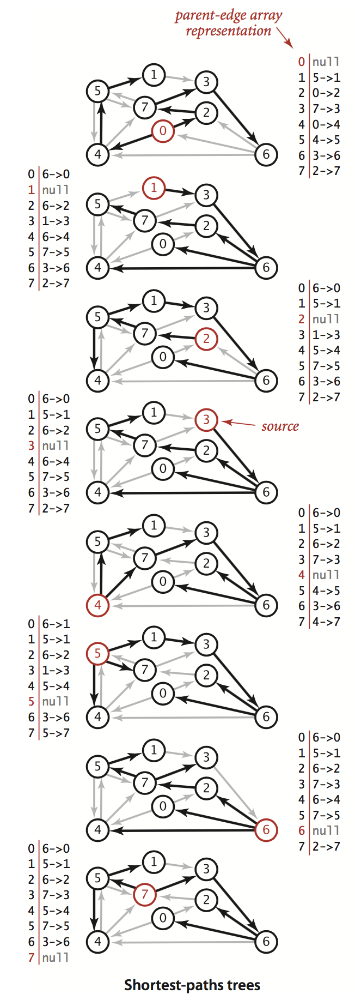

# 最短路径

最短路径问题可以归纳成：**找到从一个顶点到达另一个顶点的成本最小的路径。**


在我们的生活中有很多最短路径的应用场景：

| 应用     | 顶点   | 边      |
| ------ | ---- | ------ |
| 地图     | 交叉路口 | 公路     |
| 网络     | 路由器  | 网络连接   |
| 任务調度   | 任务   | 优先级的限制 |
| 套汇     | 货币   | 汇率     |
| 车辆路径调度 | 交叉路口 | 公路     |

针对上面的这些问题，我们都可以使用 **加权有向图** 来抽象，对实际问题的解决就转化为求解加权有向图的最短路径问题。 在前面的有向图的学习中我们关注的是从一个顶点是否可以到达另一个顶点，本节我们需要把权重考虑进来，图中的每条路径都有一个与之相关联的路径权重，其是路径中所有边的权重之和。

> 最短路径定义：在一幅加权有向图中，从顶点s到顶点t的最短路径是所有从s到t的路径中的权重最小者。

# 一. 最短路径的性质

##1. 最短路径性质

最短路径的定义很简单也很好理解，但是在简单的定义之下也有一些我们需要注意的点：

（1）求最短路径的前提是从起点s到终点t的路径是存在的。

（2）权重不代表距离，这个权重的含义有很多，我个人的理解是一种资源损耗度。

（3）并不是所有的顶点都是可达的，如果从s到t并不可达，也就并不存在什么最短路径。

（4）一般情况下我们都默认权重是非负的，如果存在负权重，问题就会十分复杂。

（5）最短路径都是简单路径，也就是不包含环。

（6）最短路径可能不是唯一的，可能存在多条路径权重相等。

单点最短路径：给定一幅加权有向图和一个起点s，从s到顶点v是否存在一条路径？如果有就找出最短路径。

## 2. 最短路径树

一般情况下我们的研究点都是**单点最短路径**。给定了起点s，计算结果是一颗最短路径树，包含了从起点s到所有可达顶点的最短路径。树的根节点是s，树中的每条路径都是有向图的一条最短路径。


下面给出最短路径树的实例图：




最短路径树是一定存在的，对于一个起点s到顶点v可能存在两条相同长度的路径。对于这种情况只需要将其中一条路径中的最后一条边删除即可。

# 二. 加权有向图的数据结构

加权有向图的边只有一个方向，所以整体来说比加权无向边更加简单。


## 1. 加权有向边的数据类型 DirectedEdge的API以及实现

| public class DirectedEdge{}              |          |
| :--------------------------------------- | -------- |
| DirectedEdge(int v, int w, double weight) |          |
| double weight()                          | 边的权重     |
| int from()                               | 边的起点的顶点  |
| int to()                                 | 边的终点的顶点  |
| String toString()                        | 对象的字符串表示 |

其实现如下图：

```java
package com.example.algorithm4.graphs.shortestpath;

/**
 * 加权有向图的边的数据结构
 *
 * @author 惜暮
 * @email chris.lyt@alibaba-inc.com
 * @date 2018/1/10
 */
public class DirectedEdge {
    /**
     * 边的起点
     */
    private final int v;
    /**
     * 边的终点
     */
    private final int w;
    /**
     * 边的权重
     */
    private final double weight;

    public DirectedEdge(int v, int w, double weight) {
        this.v = v;
        this.w = w;
        this.weight = weight;
    }

    /**
     * 获取边的起点
     * @return
     */
    public int from(){
        return v;
    }

    public int to(){
        return w;
    }

    public double weight(){
        return weight;
    }

    @Override
    public String toString() {
        return String.format("%d->%d %.2f", v, w, weight);
    }
}

```


## 2. 加权有向图的数据类型EdgeWeightedDigraph的API

| public class EdgeWeightedDigraph{}  |                 |
| ----------------------------------- | --------------- |
| EdgeWeightedDigraph(int v)          | 含有V个顶点的空有向图     |
| EdgeWeightedDigraph(In in)          | 从输入流中读取有向图的构造函数 |
| int V()                             | 顶点总数            |
| int E()                             | 边的总数            |
| void addEdge(DirectedEdge e)        | 将e 添加到该有向图中     |
| `Iterable<DirectedEdge>` adj(int v) | 从节点v指出的边        |
| `Iterable<DirectedEdge>` edges()    | 该有向图的所有的边       |
| String toString()                   | 对象的字符串表示        |


```java
package com.example.algorithm4.graphs.shortestpath;

import edu.princeton.cs.algs4.Bag;

/**
 * 加权有向图的数据类型
 *
 * @author 惜暮
 * @email chris.lyt@alibaba-inc.com
 * @date 2018/1/12
 */
public class EdgeWeightedDigraph {
    /**
     * 顶点总数
     */
    private final int V;
    /**
     * 边的总数
     */
    private int E;
    /**
     * 邻接表
     */
    private Bag<DirectedEdge>[] adj;

    public EdgeWeightedDigraph(int V) {
        this.V = V;
        this.E = 0;

        adj = (Bag<DirectedEdge>[])new Bag[V];
        for (int v=0; v<V; v++) {
            adj[v] = new Bag<>();
        }
    }


    public int V() {
        return V;
    }

    public int E() {
        return E;
    }

    /**
     * 向加权有向图中添加一条边
     * @param edge
     */
    public void addEdge(DirectedEdge edge) {
        adj[edge.from()].add(edge);
        this.E++;
    }

    /**
     * 获取从顶点v出发的节点
     * @param v
     * @return
     */
    public Iterable<DirectedEdge> adj(int v) {
        return adj[v];
    }

    /**
     * 获取加权有向图的所有的边
     * @return
     * */
    public Iterable<DirectedEdge> edges() {

        Bag<DirectedEdge> bag = new Bag<>();
        for (int v=0; v<V; v++){
            for (DirectedEdge edge : adj[v]) {
                bag.add(edge);
            }
        }

        return bag;
    }
}
```


EdgeWeightedDigraph实现了加权有向图，它维护一个由顶点索引组成的Bag对象的数组，每个Bag对象里面存储了某个顶点出发的所有有向边DirectedEdge 对象。对于有向图的特性我们可知，每条边只在邻接矩阵中出现一次，如果边从v指向w，那么边只会存储在顶点v的邻接链表中。


下图是用EdgeWeightedDigraph构造左侧的示例数据的数据结构，从图示我们可以非常easy的理解EdgeWeightedDigraph的实现过程。


## 3. 最短路径的API

求加权有向图的最短路径肯定是基于加权有向图EdgeWeightedDigraph来设计的。首先我们先设计加权有向图的API

| public class SP                        |                                  |
| -------------------------------------- | -------------------------------- |
| SP(EdgeWeightedDigraph G,  int s)      | 构造函数                             |
| double distTo(int v)                   | 从顶点s出发v的距离，如果不存在则为无穷大            |
| boolean hasPathTo(int v)               | 是否存在从顶点s到顶点v的路径                  |
| `Iterable<DirectedEdge> pathTo(int v)` | 从顶点s到顶点v的路径，返回所有的边，如果路径不存在返回null |

上面的构造函数会创建最短路径树并计算最短路径的长度。

## 4. 表示最短路径的数据结构

表示最短路径的数据结构很简单，如图所示：


- 最短路径树中的边：和深度优先搜索和广度优先搜索一样，使用一个由顶点索引的DirectedEdge对象的父链接数组edgeTo[]。其中**edgeTo[v]的值为树中连接v和它的父结点的边(也就是从s到v的最短路径上的最后一条边)**
- 到达起点的距离：我们需要一个由顶点索引的数组distTo[]，其中**distTo[v]为从s到v的已知最短路径的长度。**


我们约定：当edgeTo[s]的值为null的时候，distTo[s]的值为0。同时我们还约定，从起点到不可达的顶点的距离均为Double.POSITIVE_INFINITY。和以前一样，我们将实现这些功能。

## 5. 边的松弛

最短路径API的实现都基于一个被称为 松弛(relaxation) 的简单操作。在一个加权有向图被初始化的时候，我们知道图的边和权重，distTo[]中只有起点所对应的元素值为0，其余元素值都被初始化为Double.POSITIVE_INFINITY。随着算法的执行，它将起点到其余顶点的最短路径信息存入到了edgeTo[]和distTo[]数组中。当我们遇到一个新的边的时候，会用到松弛技术，定义如下：放松边v->w意味着检查从s到w的最短路径时是否是先从s到v，然后再从v到w，如果是则根据这个情况更新数据结构内容。由此从s到w的最短路径是distTo[v]加上e.weight()，如果这个值不小于distTo[w]，则称这条边是失效的并将它忽略。


下图显示了这个过程，图的左边是边失效的情况，不更新任何数据；另一种情况就是v->w就是到达w的最短路径，这会更新edgeTo[w]和distTo[w]的数据。 如果松弛改变了和边e相关顶点的edgeTo[]和distTo[]的数据则称e是松弛成功的。


## 6. 顶点的松弛


# 三. 最短路径算法的理论基础

## 1. 最优性条件

以下命题证明了判断路径是否为最短路径的全局条件与在放松一条边时所检测的局部条件是等价的。


> 命题P(最短路径的最优性条件)。令G为一幅加权有向图，顶点s是G中的起点，distTo[]数组是一个由顶点索引的数据，保存的是G中路径的长度。对于从s可达的所有顶点v，distTo[v]的值是从s到v的某条路径的长度，对于从s不可达的所有顶点v，该值为无穷大。当且仅当对于从v到w的任意一条边e，这些值都满足distTo[w]<=distTo[v]+e.weight() 时，它们才是最短路径的长度。


上面命题P的很重要的一个应用就是用于验证最短路径的正确性。


## 2. 通用算法

从上面的最优性条件马上就能得到一个涵盖最短路径算法的通用算法：

> 命题Q(通用最短路径算法)：将distTo[s]初始化为0，其他distTo[]元素初始化为无穷大，继续如下操作：
>
> ​                      放松G中的任意边，直到不存在有效边为止。
>
> 对于从s 可达的任意顶点w，再进行这些操作之后，distTo[w]的值即为从s到w的最短路径的长度，且edge[w]的值即为该路径上的最后一条边。


上面命题Q的通用算法并没有指定边的放松顺序，因此要证明这些算法都能通过计算得到最短路径，只需要证明它们都会放松所有的边直到所有的边都失效即可。

# 四. Dijkstra算法

迪杰斯特拉算法采用和prim算法类似方法生成最短路径树，首先将distTo[s]初始化为0，distTo[]的其他元素初始化为正无穷，然后将distTo[]中最小的非树顶点**放松**并加入树中，如此这般直到所有的顶点都在树中或则所有的非树顶点的distTo[]值均为无穷大。


> 命题R：迪杰斯特拉算法能够解决边权重非负的加权有向图的单起点最短路径问题。
>
> 


## 1.Dijkstra算法的数据结构


## 2.换个角度看问题

> 命题R变种：在一幅含有V个顶点E条边的加权有向图中，使用迪杰斯特拉算法计算根节点为给定起点的最短路径树所需要空间与V成正比，时间与 ElogV 成正比。


## 3.算法变种优化


# 五. 无环加权有向图中的最短路径算法

## 1. 算法实现


## 2. 最长路径


## 3. 平行调度任务


## 4.相对于最后期限限制下的并行任务调度


# 六. 一般加权有向图(负权重)中的最短路径问题


## 1. 算法尝试


## 2.负权重的环


## 3.尝试III(Bellman-Ford算法)


## 4. 基于队列的Bellman-Ford算法


## 5. 负权重的边

·


## 6. 负权重环的检测


## 总结